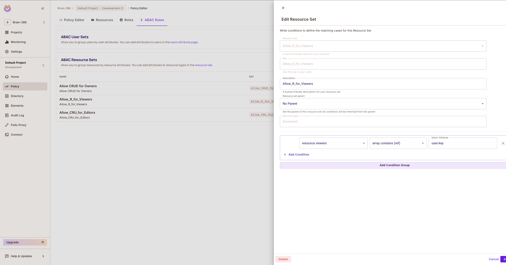

# Permit IO Auth Challenge: Document and Team Management API with Fine-Grained Access Control

## Overview

This API, built with [NestJS](https://nestjs.com), demonstrates a robust and API-first approach to authorization using [Permit.io](https://docs.permit.io/). It provides user authentication and manages documents and teams with a sophisticated permission-based access control system.

**Key Features Demonstrating Thoughtful Authorization:**

* **Externalized Authorization:** Access control decisions are handled by Permit.io, not hardcoded within the application logic, adhering to API-first principles.
* **Declarative Policies:** Permissions are defined through clear and manageable policies in Permit.io, allowing for easy updates and auditing.
* **Attribute-Based Access Control (ABAC):** The application leverages ABAC to enforce fine-grained control based on user and resource attributes (e.g., document owners, document editors and document viewers).
* **Real-World Scenarios:** The document and team management domains showcase practical access control challenges and their elegant solutions using Permit.io.

## Project Setup

This section guides you through setting up the project and connecting it to Permit.io.

### Prerequisites

* [Node.js](https://nodejs.org/) (version >= 18 recommended)
* [pnpm](https://pnpm.io/) (a much better alternative to npm)
* [Docker](https://www.docker.com/) (for running the Permit.io Container PDP)

### Installation

1.  Clone the repository:
    ```bash
    git clone https://github.com/TylerMutai/permit.io-auth-challenge.git
    cd permit.io-auth-challenge
    ```

2.  Install dependencies:
    ```bash
    pnpm install
    ```

### Connecting to Permit.io (Container PDP with ABAC)

This project utilizes the **Container PDP** from Permit.io to leverage Attribute-Based Access Control (ABAC) since the cloud PDP provided by permit.io doesn't support this at the moment. Follow these steps to connect your application:

1.  **Obtain your Permit.io Token and API Key:** Follow the official [Permit.io tutorial on connecting your app](https://docs.permit.io/overview/connecting-your-app).

2.  **Deploy the Permit.io Container PDP:** Instead of the Cloud PDP, you will need to deploy the Docker container provided by Permit.io. This is essential for demonstrating __Attribute Based Access Control (ABAC)__ effectively since the cloud based PDP does not support this. The documentation for setting up the Container PDP can be found [here](https://docs.permit.io/how-to/deploy/deploy-to-production).
    - ### The TLDR version is:
    1. Install docker: https://docs.docker.com/get-started/get-docker/
    2. Run the docker container:
    ```bash
    docker run -it \
    -p 7766:7000 \
    --env PDP_API_KEY=<YOUR_PERMIT_IO_API_KEY> \
    --env PDP_DEBUG=True \
    permitio/pdp-v2:latest
    ```
    Your pdp server should now be running under `http://localhost:7766`

    If you get errors that the URL `http://localhost:8181` is unreachable (your OPA REST API - OPA stands for Open Policy Agent, and is the policy enforcement engine that "lets you specify policy as code and simple APIs to offload policy decision-making from your software.". This is a dependency required by permit.io. You can read more about them [here.](https://www.openpolicyagent.org/docs/latest/)), run the following:
    ```bash
    docker run -it \
    -p 8181:8181 \
    --env PDP_API_KEY=<YOUR_PERMIT_IO_API_KEY> \
    --env PDP_DEBUG=True \
    permitio/pdp-v2:latest
    ```
    This will expose your OPA REST API on the port 8181.

3.  **Configure Environment Variables:** Create a `.env` file in the root of your project and add the following environment variables (feel free to use the `.env.example` file at the root of the project as a reference):

    ```
    APP_SECRET="your_secret_key"
    PERMIT_IO_TOKEN="your_permit_io_api_key"
    PERMIT_IO_URL="http://localhost:7766" # Default URL for the Container PDP
    ```

    **Note:** Replace `"your_secret_key"` (which is any random and secure alphanumeric string that you can generate online) and `"your_permit_io_api_key"` with your actual values. Ensure the `PERMIT_IO_URL` points to where your Permit.io Container PDP is running, which ideally should be `http://localhost:7766` if you used the default configurations highlighted above.

4.  **Understand Attribute-Based Access Control (ABAC):** This project demonstrates ABAC, where access decisions are based on attributes of the user, the resource (document), and the environment. You can learn more about ABAC concepts on the [Permit.io ABAC overview page](https://docs.permit.io/how-to/build-policies/abac/overview).

5. __An important thing to note: [This URL for the audit log](https://app.permit.io/audit) will come in handy when trying to debug permission policies. It provides a detailed log of reasons why access to a particular resource was denied, which is handy especially in debugging attribute-based access controls.__

## Running the Application

```bash
# Development mode with live reloading
pnpm run start:dev

# Production mode
pnpm run start:prod
```

The API will be accessible at `http://localhost:3000`.

## Architecture Overview

This section provides a high-level view of the application's architecture, from server startup to request handling, authentication, and authorization.

### Folder Structure (General)

```text
src/
├── main.ts              # Application bootstrap
├── controllers/         # Route handlers define API endpoints
├── services/            # Business logic and data access
├── guards/              # Request guards for authentication and authorization
├── filters/             # HTTP exception filters for error handling
├── dtos/                # Data Transfer Objects for request/response validation and transformation
└── decorators/          # Custom decorators (e.g., @RESTUserDecorator for obtaining the logged in user object)
```

### Folder Structure (Modules)
```text
src/
├── auth/                # Contains all authentication logic, including route guards to block unauthenticated users.
├── common/              # Contains re-usable business logic, like HTTP Exception filters (which handles response transformation, and optional logging of errors).
├── documents/           # Contains all business logic related to documents.
├── permissions/         # Contains all business logic related to permissions, role based access control and attribute based access control (which is typically a wrapper around permit.io).
├── teams/               # Contains all business logic related to teams.
└── users/               # Contains all business logic related to users.
```

### Server Startup

1. `main.ts` uses `NestFactory` to create the application instance.
2. Global pipes (e.g., `ValidationPipe`) validate and transform incoming requests based on DTOs.
3. Global filters catch and format HTTP exceptions (and optionally log them) ensuring standardized response formats even for thrown errors.

### Authentication & Authorization

- Authentication is handled via Json Web Tokens(JWTs) strategy in the `auth` module - by the help of `@nestjs/jwt` package, which is based off the `jsonwebtoken` package.
- Upon sign-in, a JWT is issued and must be included in the `Authorization: Bearer <token>` header.
- Guards:
  - `AuthGuard` verifies the JWT and if valid, attaches the logged-in user object to the request, and allows the request to continue. Otherwise, throws a `401 Unauthorized Exception`. 
  - `PermissionsGuard` checks user permissions before allowing access. This guard has the `PermissionsService` which is a wrapper around permit.io as an instance variable which the guard calls to verify access. 
- Guards are applied using the `@UseGuards()` decorator at the controller or route level for protected endpoints.

### Controllers & Services

- Controllers define HTTP endpoints and delegate business logic to services.
- Services implement core application logic, interact with data sources, and (in cases of the `PermissionsService`) call Permit.io for policy decisions.

### DTOs & Validation

- DTOs live in the `dtos/` folder and use `class-validator` to enforce request schemas.
- Decorators like `@Body()`, `@Param()`, and custom validation pipes ensure data validation and consistency before it reaches controllers.

### Request Flow

1. Incoming request hits a controller route (e.g., `GET /documents`).
2. `AuthGuard` checks the JWT and populates `request.user`.
3. `PermissionsGuard` enforces authorization rules via Permit.io.
4. Global `ValidationPipe` transforms and validates DTOs.
5. Controller calls service methods to perform business logic and data operations.
6. Service may invoke Permit.io PDP to evaluate fine-grained ABAC policies (in the cases of reading one document, which has specific access according to owners, editors and viewers).
7. Response is returned or an exception is thrown, which is handled by global filters.

### More About how ABAC is Set-Up
I'll explain more here on how ABAC was set up on permit.io, and it's adaptation to this project.

For starters, there's 2 ways of creating users on your permit.io dashboard:
1. [Via the user management screen on the dashboard](https://docs.permit.io/how-to/sync-users/#via-the-user-management-screen). If you don't see the `Users` section on your sidebar, navigate to the `Directory` section where you should now see the options highlighted in the documentation. Under the `key` field, make sure to specify a unique identifier for your user, which will consequently be used to cross-check policies against by permit.io.
2. [Via the permit SDK](https://docs.permit.io/how-to/sync-users/#via-the-sdks). Unfortunately, I opted the user management screen for the purposes of this demonstration, and therefore I might not be of much help if you choose to go this route. The documentation is very detailed though, so it should get you far enough.

Second, a `Document` has 3 access radii: 'viewers', 'editors' and 'owners'.
- 'owners' are the creators of the documents and have full CRUD access to the specific document.
- 'editors' have full CRUD access other than the DELETE ability.
- 'viewers' only have READ access.

Setting this up on permit.io involved creating the 3 different ABAC policies as shown in the following screenshots (note `resource.viewers`, `resource.editors`,`resource.owners` fields, which are of the type string array (or an array of strings) set to match the `user.key` which is the `userId` - the unique ID of your user object/model. The attribute checker will then match to see whether the array contains the value represented by the `user.key` parameter):

#### Viewer Permissions


#### Editor Permissions


#### Owner Permissions


#### Lastly, this is how I configured access controls based on these attributes
Note in the screenshot that the attributes are duplicated across roles, which is OK, since they remain constant regardless of role.

#### Admin Role


#### Editor Role


#### Viewer Role


The first column (that starts with 'Allow_CRUD') represents permissions for owners, the column after (that starts with 'Allow_CRU') is for editors, and the last column (that starts with 'Allow_R') is for viewers. As you can note, these permissions are duplicated across roles by design. However, say you wanted admins to have access to all documents regardless, under the 'admin' role, you could alternatively adjust the permissions to allow this.

This highlights the power of ABAC in that you can go a level further and have granular access control on top of roles.

Here's a code example of enforcing attribute-based access control in code (note the 'resource' parameter where I pass the attributes as defined previously for 'owners','editor' and 'viewers', and the 'user' parameter, where I pass in the 'user.key' which is the unique user ID to cross-check against.):

```typescript
export class DocumentsService {
  async findOne(
    user: UserModel,
    { id }: GetDocumentRequestDto,
  ): Promise<GetDocumentResponseDto> {
    const doc = this.documents.find((d) => d.id === id);
    if (!doc) {
      throw new NotFoundException(`Document ${id} not found`);
    }
    const _doc = toDocumentDtoModel(doc);
    // check document permissions.
    const isPermitted = await this.permissionsService.checkPermission({
      user: {
        key: user.id,
      },
      resource: {
        type: 'Document',
        attributes: {
          owners: _doc.owners,
          editors: _doc.editors,
          viewers: _doc.viewers,
        },
      },
      action: 'readone',
    });

    if (!isPermitted) {
      throw new ForbiddenException(`User not allowed to access document ${id}`);
    }
    return {
      status: 200,
      message: 'Success',
      payload: toDocumentDtoModel(doc),
    };
  }
}
```

## API Documentation

### Base URL

```
http://localhost:3000
```

### Authentication

The API uses JWT for authentication.

* Obtain a JWT token by calling the **Sign In** endpoint.
* Include the token in the `Authorization` header of protected requests:

    ```
    Authorization: Bearer <token>
    ```

### Endpoints

#### Health Check

**GET** `/`

-   Description: Returns a simple greeting to verify the API is running.
-   Authentication: None
-   Response (200 OK):
    ```json
    "Hello World!"
    ```

---

#### Sign In

**POST** `/auth/sign-in-with-email-password`

-   Description: Authenticates a user using their email and password and returns a JWT token.
-   Authentication: None
-   Request Body (application/json):

    | Field    | Type                              | Required | Description                                   |
        |----------|-----------------------------------|----------|-----------------------------------------------|
    | source   | `'ios'` \| `'android'` \| `'web'` | No       | Client platform (optional, for context)       |
    | email    | `string`                          | Yes      | User's email address (must be a valid format) |
    | password | `string`                          | Yes      | User's password                               |

-   Response (200 OK):

    ```json
    {
      "status": 200,
      "message": "Success",
      "token": "<jwt_token>",
      "user": {
        "status": 200,
        "message": "Success",
        "payload": {
          "id": "admin_user",
          "name": "Admin User",
          "email": "adminuser@test.com",
          "role": {
            "role": "admin",
            "tenant": "default"
          }
        }
      }
    }
    ```

-   Response (401 Unauthorized):

    ```json
    {
      "status": 401,
      "message": "Wrong email/password combination"
    }
    ```

---

## Documents API

These endpoints demonstrate permission-based access control for documents using Permit.io.

**Authorization Logic (Managed by Permit.io):**

Access to documents is governed by policies defined in Permit.io. These policies consider the authenticated user's roles, the document's attributes (e.g., owners, editors, viewers), and potentially other contextual information. The API interacts with the Permit.io PDP to enforce these policies before allowing access to resources.

**Headers:**

```
Authorization: Bearer <token>
```

#### Get All Documents

**GET** `/documents`

-   Description: Retrieves a list of all documents that the authenticated user has **view** permission for, according to Permit.io policies.
-   Path Parameters: None
-   Request Body: None
-   Response (200 OK):

    ```json
    {
      "status": 200,
      "message": "Success",
      "payload": [
        {
          "id": "string",
          "title": "string",
          "content": "string",
          "owners": [
            "string"
          ],
          "editors": [
            "string"
          ],
          "viewers": [
            "string"
          ]
        }
      ]
    }
    ```

#### Get Document by ID

**GET** `/documents/:id`

-   Description: Retrieves a specific document by its ID, only if the authenticated user has **view** permission for that document according to Permit.io policies.
-   Path Parameters:

    | Parameter | Type     | Required | Description |
        |-----------|----------|----------|-------------|
    | id        | `string` | Yes      | Document ID |

-   Response (200 OK):

    ```json
    {
      "status": 200,
      "message": "Success",
      "payload": {
        "id": "string",
        "title": "string",
        "content": "string",
        "owners": [
          "string"
        ],
        "editors": [
          "string"
        ],
        "viewers": [
          "string"
        ]
      }
    }
    ```

-   Response (404 Not Found):

    ```json
    {
      "status": 404,
      "message": "Document <id> not found"
    }
    ```

-   Response (403 Forbidden):

    ```json
    {
      "status": 403,
      "message": "User not allowed to access document <id>"
    }
    ```

#### Create Document

**POST** `/documents`

-   Description: Creates a new document. The authenticated user automatically gains **owner** permission for the created document through Permit.io policies.
-   Request Body (application/json):

    | Field   | Type                              | Required | Description                |
        |---------|-----------------------------------|----------|----------------------------|
    | source  | `'ios'` \| `'android'` \| `'web'` | No       | Client platform (optional) |
    | title   | `string`                          | Yes      | Title of the document      |
    | content | `string`                          | Yes      | Content of the document    |
    | owners  | `string[]`                        | No       | Initial list of owner IDs  |
    | editors | `string[]`                        | No       | Initial list of editor IDs |
    | viewers | `string[]`                        | No       | Initial list of viewer IDs |

-   Response (200 OK):

    ```json
    {
      "status": 200,
      "message": "Success",
      "payload": {
        "id": "string",
        "title": "string",
        "content": "string",
        "owners": [
          "string"
        ],
        "editors": [
          "string"
        ],
        "viewers": [
          "string"
        ]
      }
    }
    ```

#### Update Document

**PATCH** `/documents/:id`

-   Description: Updates fields of an existing document. Only users with **edit** or **owner** permissions (as determined by Permit.io) can perform this action.
-   Path Parameters:

    | Parameter | Type     | Required | Description |
        |-----------|----------|----------|-------------|
    | id        | `string` | Yes      | Document ID |

-   Request Body (application/json):

    | Field   | Type                              | Required | Description            |
        |---------|-----------------------------------|----------|------------------------|
    | source  | `'ios'` \| `'android'` \| `'web'` | No       | Client platform        |
    | title   | `string`                          | No       | New document title     |
    | content | `string`                          | No       | New document content   |
    | owners  | `string[]`                        | No       | New list of owner IDs  |
    | editors | `string[]`                        | No       | New list of editor IDs |
    | viewers | `string[]`                        | No       | New list of viewer IDs |

-   Response (200 OK):

    ```json
    {
      "status": 200,
      "message": "Success",
      "payload": {
        "id": "string",
        "title": "string",
        "content": "string",
        "owners": [
          "string"
        ],
        "editors": [
          "string"
        ],
        "viewers": [
          "string"
        ]
      }
    }
    ```

#### Delete Document

**DELETE** `/documents/:id`

-   Description: Deletes a document. Only users with **owner** permission (as determined by Permit.io) can perform this action.
-   Path Parameters:

    | Parameter | Type     | Required | Description |
        |-----------|----------|----------|-------------|
    | id        | `string` | Yes      | Document ID |

-   Response (204 No Content):

    ```json
    {
      "status": 204,
      "message": "Success"
    }
    ```

---

## Teams API

These endpoints demonstrate permission-based access control for teams using Permit.io.

**Authorization Logic (Managed by Permit.io):**

Access to teams is also governed by policies defined in Permit.io. These policies might consider user roles and team memberships to determine who can view, create, update, or delete teams.

**Headers:**

```
Authorization: Bearer <token>
```

#### Get All Teams

**GET** `/teams`

-   Description: Retrieves a list of all teams that the authenticated user has **view** permission for, according to Permit.io policies.
-   Response (200 OK):

    ```json
    {
      "status": 200,
      "message": "Success",
      "payload": [
        {
          "id": "string",
          "name": "string",
          "userIds": [
            "string"
          ]
        }
      ]
    }
    ```

#### Get Team by ID

**GET** `/teams/:id`

-   Description: Retrieves a specific team by its ID, only if the authenticated user has **view** permission for that team according to Permit.io policies.
-   Path Parameters:

    | Parameter | Type     | Required | Description |
        |-----------|----------|----------|-------------|
    | id        | `string` | Yes      | Team ID     |

-   Response (200 OK):

    ```json
    {
      "status": 200,
      "message": "Success",
      "payload": {
        "id": "string",
        "name": "string",
        "userIds": [
          "string"
        ]
      }
    }
    ```

-   Response (404 Not Found):

    ```json
    {
      "status": 404,
      "message": "Team <id> not found"
    }
    ```

#### Create Team

**POST** `/teams`

-   Description: Creates a new team. The authenticated user might automatically gain certain permissions for the created team based on Permit.io policies (e.g., membership or admin rights).
-   Request Body (application/json):

    | Field   | Type                              | Required | Description                      |
        |---------|-----------------------------------|----------|----------------------------------|
    | source  | `'ios'` \| `'android'` \| `'web'` | No       | Client platform (optional)       |
    | name    | `string`                          | Yes      | Name of the team                 |
    | userIds | `string[]`                        | Yes      | List of initial user IDs in team |

-   Response (200 OK):

    ```json
    {
      "status": 200,
      "message": "Success",
      "payload": {
        "id": "string",
        "name": "string",
        "userIds": [
          "string"
        ]
      }
    }
    ```

#### Update Team

**PATCH** `/teams/:id`

-   Description: Updates fields of an existing team. Only users with appropriate permissions (e.g., team admin) as determined by Permit.io can perform this action.
-   Path Parameters:

    | Parameter | Type     | Required | Description |
        |-----------|----------|----------|-------------|
    | id        | `string` | Yes      | Team ID     |

-   Request Body (application/json):

    | Field   | Type       | Required | Description          |
        |---------|------------|----------|----------------------|
    | name    | `string`   | No       | New name of the team |
    | userIds | `string[]` | No       | New list of user IDs |

-   Response (200 OK):

    ```json
    {
      "status": 200,
      "message": "Success",
      "payload": {
        "id": "string",
        "name": "string",
        "userIds": [
          "string"
        ]
      }
    }
    ```

#### Delete Team

**DELETE** `/teams/:id`

-   Description: Deletes a team. Only users with specific permissions (e.g., organization admin) as determined by Permit.io can perform this action.
-   Path Parameters:

    | Parameter | Type     | Required | Description |
        |-----------|----------|----------|-------------|
    | id        | `string` | Yes      | Team ID     |

-   Response (204 No Content):

    ```json
    {
      "status": 204,
      "message": "Success"
    }
    ```

---

## Error Handling

All error responses follow a consistent structure:

```json
{
  "status": "<HTTP status code>",
  "message": "<Error message>"
}
```

The API utilizes standard HTTP status codes to indicate the outcome of requests (e.g., 400 for bad requests, 401 for unauthorized access, 403 for forbidden actions, 404 for not found resources).

## Postman Collection

A Postman collection containing example requests for all endpoints is available at the root of the project: `permit.io.postman_collection.json`. This can be imported into Postman to easily test the API.